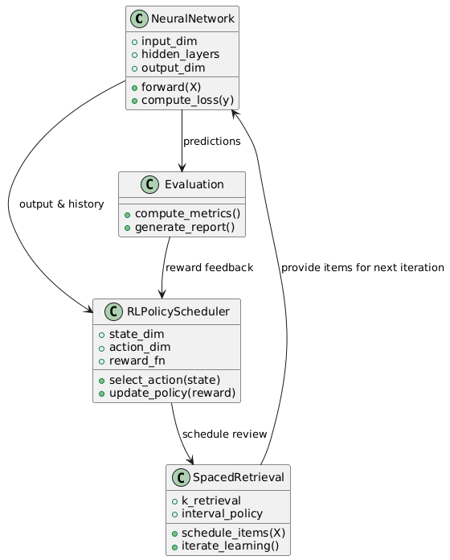

# Spaced RL Classifier

Repo ini berisi implementasi **Spaced Reinforcement Learning Classifier**, sebuah sistem pembelajaran adaptif untuk data tabular. Sistem ini memadukan neural network dengan kebijakan RL untuk menentukan kapan suatu item data dipelajari ulang (spaced learning).  

---

## UML Overview



Di diagram UML ini, ada empat modul utama:

1. **NeuralNetwork**  
   Ini inti sistem, tempat data diproses. Fitur masuk, melewati beberapa lapisan tersembunyi, dan akhirnya menghasilkan prediksi. Ada metode `forward()` untuk inferensi dan `compute_loss()` untuk menghitung error. Output dan historinya digunakan RLPolicyScheduler sebagai informasi state, jadi RL tahu strategi belajar selanjutnya.

2. **RLPolicyScheduler**  
   Bertugas memilih kebijakan pembelajaran adaptif. Misal, menentukan kapan materi tertentu harus diulang, berdasarkan reward dari evaluasi sebelumnya. Kebijakan ini memengaruhi SpacedRetrieval, menentukan urutan dan jadwal item.

3. **SpacedRetrieval**  
   Mengatur konsep pembelajaran bertahap. Menerima kebijakan dari RLPolicyScheduler dan menentukan item mana yang dipelajari ulang dan kapan. Item yang dijadwalkan ulang kembali diproses NeuralNetwork, membentuk loop pembelajaran.

4. **Evaluation**  
   Mengukur performa model (accuracy, precision, recall, F1-score). Prediksi NeuralNetwork digunakan untuk evaluasi. Hasil evaluasi menjadi feedback/reward untuk RLPolicyScheduler agar strategi belajar bisa disesuaikan.

**Intinya:** NeuralNetwork fokus pada prediksi, RLPolicyScheduler mengatur strategi, SpacedRetrieval menentukan urutan belajar, dan Evaluation memberi feedback agar loop belajar adaptif berjalan terus.

---

## Cara Pakai

### 1. Install dependencies

```bash
pip install torch pandas scikit-learn
```

### 2. Clone repository

```bash
git clone https://github.com/ArzeonXyl/spaced-rl-classifier.git
cd spaced-rl-classifier
```

### 3. Import dan load data

```python
import pandas as pd
import torch
from spaced_rl_classifier import SpacedRLClassifier, SimpleMLP, RLSchedulerPolicy, build_items_helper
from sklearn.datasets import load_iris
from sklearn.model_selection import train_test_split

# Load dataset (contoh: Iris)
data = load_iris(as_frame=True)
df = data.frame
X, y = df.drop(columns=['target']), df['target']

X_train, X_test, y_train, y_test = train_test_split(X, y, test_size=0.2, random_state=42)
```

### 4. Preprocessing & Build items

```python
X_train_proc, y_train_proc, scaler = SpacedRLClassifier.preprocess_tabular(
    pd.concat([X_train, y_train], axis=1), target_col='target'
)
X_test_proc, y_test_proc, _ = SpacedRLClassifier.preprocess_tabular(
    pd.concat([X_test, y_test], axis=1), target_col='target'
)

# Build items (helper)
items = build_items_helper(X_train_proc, y_train_proc)
items += build_items_helper(X_test_proc, y_test_proc)
```

### 5. Inisialisasi model dan policy

```python
input_dim = X_train_proc.shape[1]
num_classes = len(y.unique())

model = SimpleMLP(dim=input_dim, hidden=64, n_classes=num_classes)
policy = RLSchedulerPolicy(n_classes=num_classes, hidden=32)

clf = SpacedRLClassifier(model=model, policy=policy, device='cpu')
```

### 6. Training

```python
train_count = len(y_train_proc)
clf.fit(items, train_count=train_count, epochs=10, batch_size=16)
```

### 7. Evaluasi

```python
test_idx = list(range(len(y_train_proc), len(items)))  # indeks test
results = clf.evaluate(test_idx)
print(results["report"])
print("Accuracy:", results["accuracy"])
```
